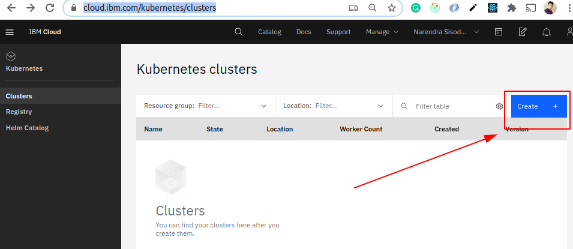
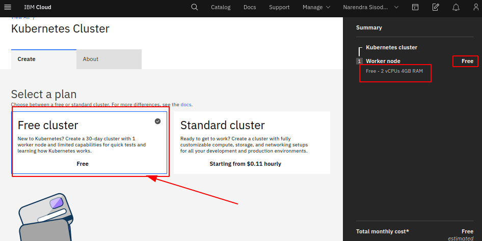
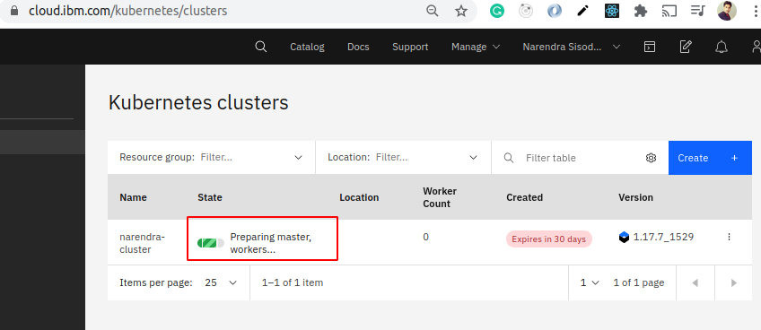
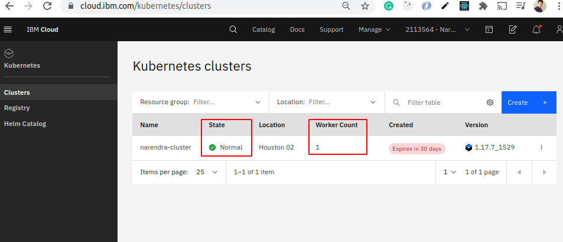
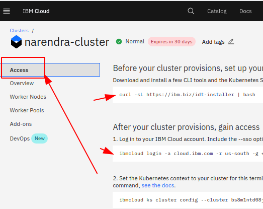
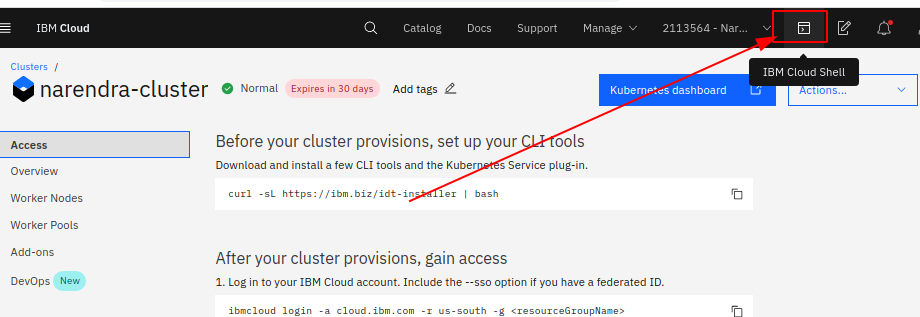

Visit - https://cloud.ibm.com/kubernetes/clusters and Click on `Create`

Now click on Free cluster and Upgrade and Create your kubernetes cluster on IBM cloud.

 Give name to your cluster - for me my cluster name is - `narendra-cluster`

 Now visit again - https://cloud.ibm.com/kubernetes/clusters , you can see our cluster is preparing.

It will take 10-15 minutes to full working Kubernetes cluster.

After Sucess

You can see, only 1 worker node is created.

Setup Access
=============

Click on `Access` and follow instructions.

Or you can also use IBM cloud shell too to access the Cluster.

Kubernetes Dashboard
====================
You can explore Kubernetes Dashboard from here

 

and this

 

