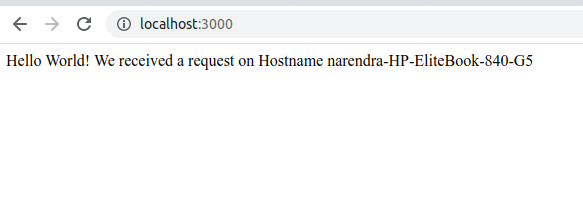
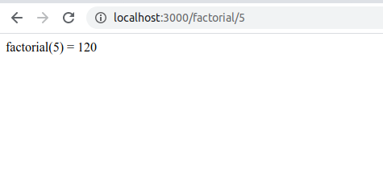

Chapter 2 -Run Helloworld service Locally
=========================================

Visit https://github.com/nsisodiya/Kubernetes-Workshop/tree/master/code/1-hello-world-microsvc to vide the code

Base Code
=========

```js
const express = require("express");
const app = express();
var os = require("os");
var hostname = os.hostname();

app.get("/", (req, res) => {
  console.log(`Hello world received a request on Hostname ${hostname}`);
  const target = process.env.TARGET || "World";
  res.send(`Hello ${target}! We received a request on Hostname ${hostname}`);
});

function factorial(n) {
  var total = 1;
  for (let index = 1; index <= n; index++) {
    total = total * index;
  }
  return total;
}

app.get("/factorial/:n", (req, res) => {
  const n = parseInt(req.params.n); // 'user'
  res.send(`factorial(${n}) = ${factorial(n)}`);
});

const port = process.env.PORT || 3000;
app.listen(port, () => {
  console.log("Hello world listening on port", port);
});

```


Run Locally using npm
=====================
```sh
git clone https://github.com/nsisodiya/Kubernetes-Workshop.git
cd Kubernetes-Workshop/code/1-hello-world-microsvc
npm install
npm start
```

Open http://localhost:3000/
Open http://localhost:3000/factorial/5

[](#)
[](#)

Run Locally using Docker
========================

1. Build Image
```
docker build -t helloworld-microsvc .
```

2. Run the container from iamge as Demon.

```
docker run -d --name helloworld-microsvc-container  -p 3000:3000 helloworld-microsvc
docker container list -a
docker logs --follow helloworld-microsvc-container
```

1. Open http://localhost:3000/

or

```
curl http://localhost:3000
```

[](#)

Please note that, Hostname is basically container id. We will create multiple pods (containers) in cluster and our traffic will be split between containers. This we will verify from container id.


1. Cleapup

```
docker rm -f helloworld-microsvc-container
```


Next ?
======

So, we are able to run our image on our system.
Now we want to run the docker image on our Kubernetes cluster. for this we need to host our Docker image on any docker registry.
There are two types of Docker registry. Private and Public.

Public docker registry is good for testing/demo and public images But you must never host your private code on public code.
In CI/CD setup, whenever we commit on our branch, the pipeline should build image and upload to private registry and inform cluster that new docker image is available. We can then pull new image and deploy to our cluster. 
This is called revisions.

So, for now, We will deploy our hello world on Public Registry but later on we will setup private CI/CD pipeline.

[NEXT: 3-Upload-Docker-Image-On-Public-DockerHub](./3-Upload-Docker-Image-On-Public-DockerHub.md)
