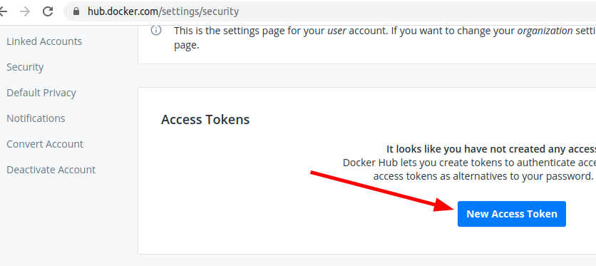
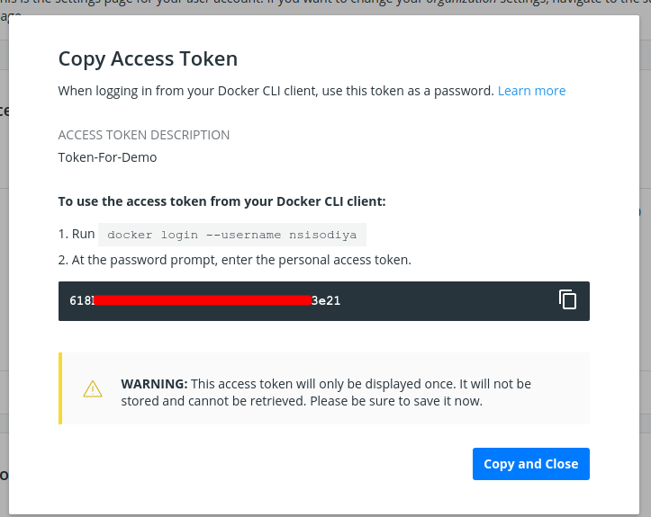
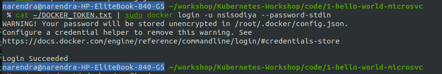
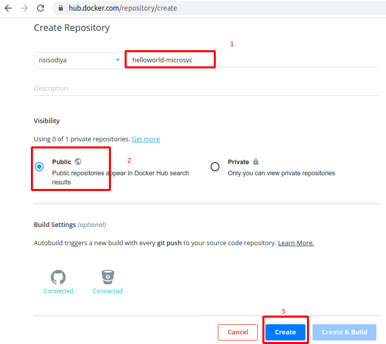
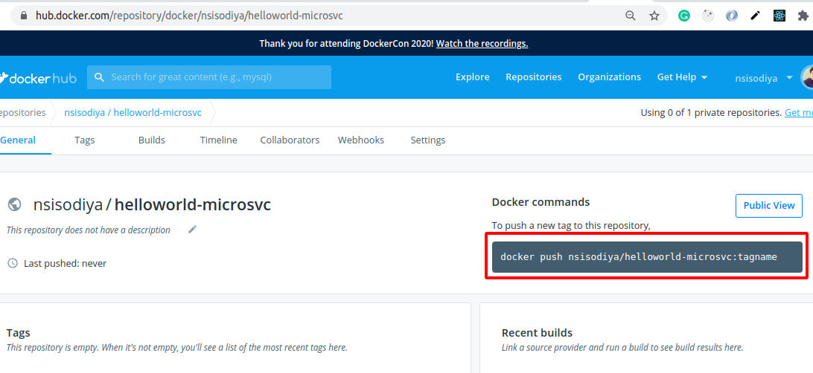
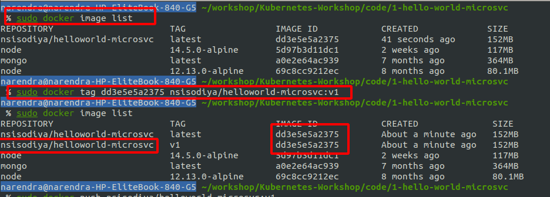
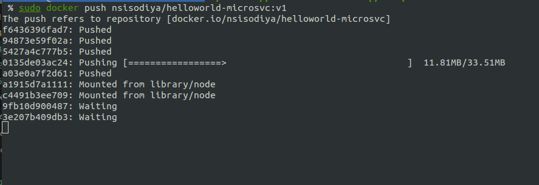
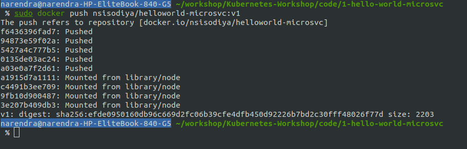
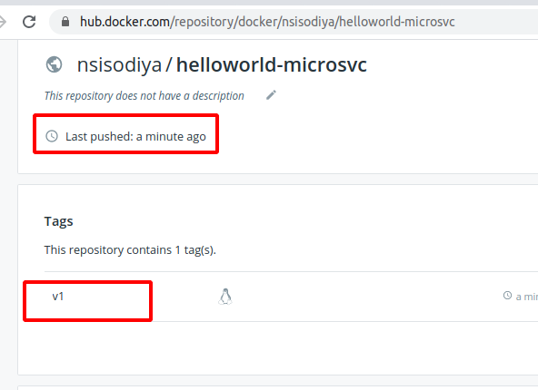

Chapter 3 - Upload Docker Image on Public DockerHub
===================================================

Lets try to upload our docker image on public registry.

DockerHub
=========
To publish any image to docker, we need to login to docker registry.
We need to tag our docker image to identify between different versions of same image.
Think as git versions.
and then publish.

Step 1 - get Token
===================

Make a login on https://hub.docker.com and visit https://hub.docker.com/settings/security
for creating AccessToken.


[](#)
[](#)


Save the above Token in Home directory. `~/DOCKER_TOKEN.txt`.
Warning : Include DOCKER_TOKEN.txt in your git repo otherwise you may push it on git repo.


Step 2 - Login to docker registry
================================
```
cat ~/DOCKER_TOKEN.txt | sudo docker login -u nsisodiya --password-stdin
```


[](#)

for me, Login Success.


Step 3 - Create repo.
====================

visit https://hub.docker.com/repository/create to create repo.

[](#)

[](#)

Note down the command, we will need in next step.


Step 4 - Build your Image
================================
Build Image (Skip If you have done it) then list the docker images
```
cd code/1-hello-world-microsvc
sudo docker build -t nsisodiya/helloworld-microsvc .
sudo docker image list
```

[](#)

you can see Image id from this command.


Step 5 - Tag and Publish Image
======================  
Now, we are tagging our image and publish it to DockerHub.
Replace correct `image-id` and `username` in following commands.

```
sudo docker image list
sudo docker tag dd3e5e5a2375 nsisodiya/helloworld-microsvc:v1
sudo docker image list
sudo docker push nsisodiya/helloworld-microsvc:v1
```

[](#)

Pusing Image

[](#)

Pushed

[](#)

After publish, you can verify at github.

[](#)


Next ??
=========

So our Docker image is ready, lets deploy it on our Cluster.

[NEXT: 4-Deploy-Our-Docker-Image-On-Cluster](./4-Deploy-Our-Docker-Image-On-Cluster.md)