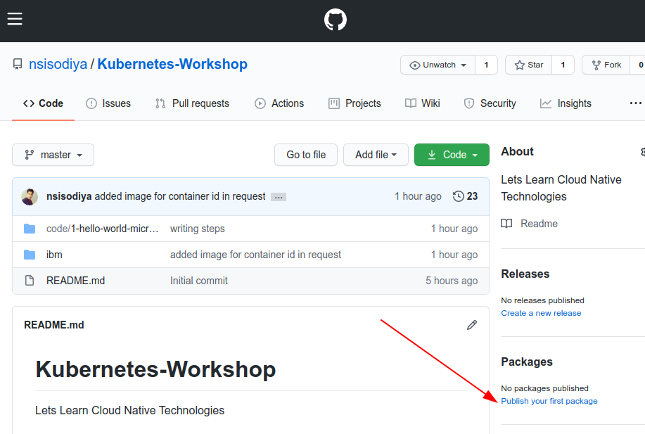
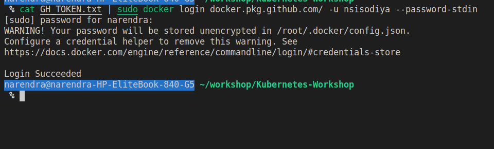
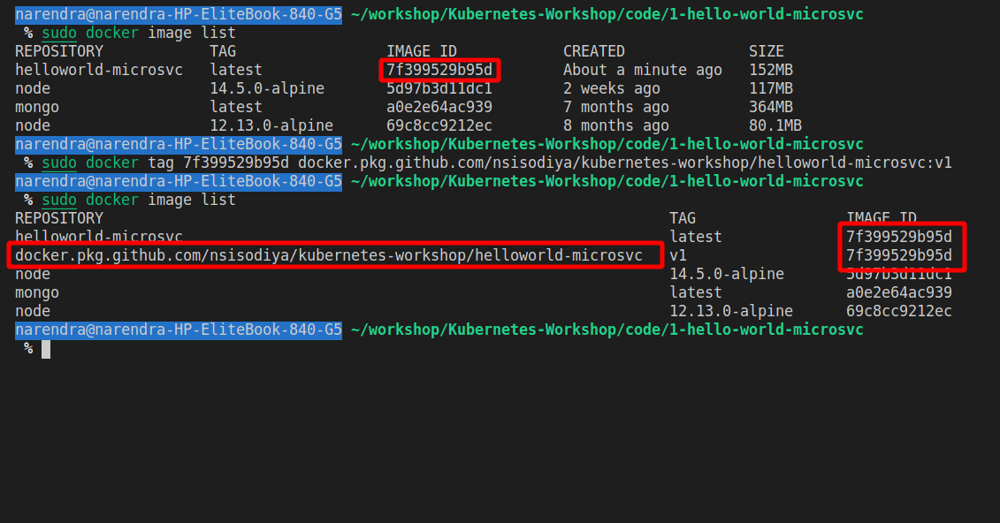

Lets try to upload our docker image on public registry.

Github Docker Registry
======================

We are going to use Github Docker registry for now.

[](#)
[](#)
[](#)

to public any image to docker, we need to login to docker registry.
We need to tag our docker image to identify between different versions of same image.
Think as git versions.
and then public.
lets do it.

Step 1 - get Github Token
=========================

Warning : Include GH_TOKEN.txt file in `.gitignore` and `.dockerignore` so that you will not commit this file accidentally.
So, Go to Github Setting and Developer Setting and Create a new Token. Make sure you Notedown your token and save token to GH_TOKEN.txt file. And don't forget to give sufficient permissions.


[](#)
[](#)
[](#)
[](#)

Step 2 - Login to docker registry
================================
```
cat GH_TOKEN.txt | docker login docker.pkg.github.com/ -u nsisodiya --password-stdin
```

Its better to store the token in home directory. like ~/.github/GH_TOKEN.txt
You probably need to use `sudo docker` if above command don't work.

[](#)

for me, Login Success.


Step 3 - Build and Tag your Image
================================
Build Image (Skip If you have done it) then list the docker images
```
cd code/1-hello-world-microsvc     # Make sure you should be right directory.
docker build -t helloworld-microsvc . # Skip this if you have created
docker image list
```
you can see Image id from this command.

Now, Tag
```
docker tag IMAGE_ID docker.pkg.github.com//nsisodiya/kubernetes-workshop/IMAGE_NAME:VERSION
```

you need to replace these command with your image-name, repo-name and image name. for me, I will use this.

```
sudo docker tag 7f399529b95d docker.pkg.github.com/nsisodiya/kubernetes-workshop/helloworld-microsvc:v1
sudo docker image list
```

[](#)
[](#)

Step 4 - Publish Image
======================  

```
docker push docker.pkg.github.com/nsisodiya/kubernetes-workshop/helloworld-microsvc:v1
```
Again, you need to see exact instructions in your git repo.

[](#)

After publish, you can verify at github.

[](#)