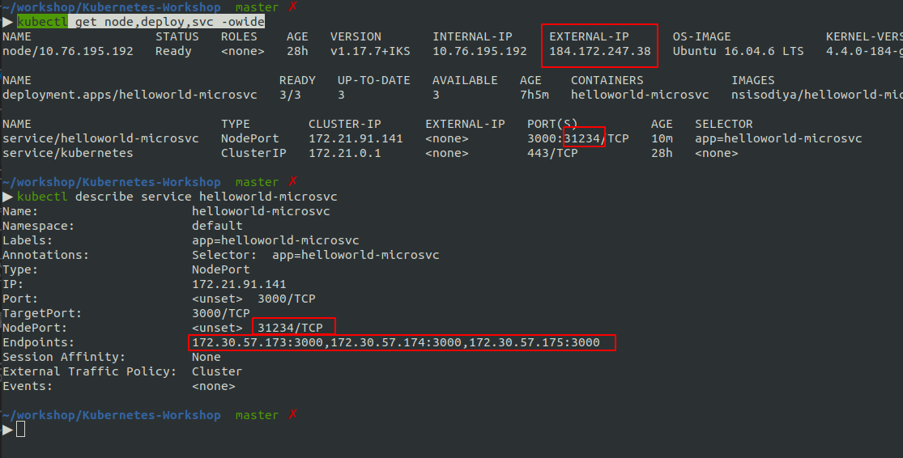
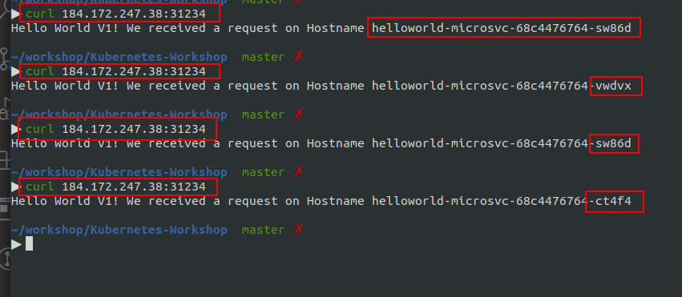

Chapter 5 - Expose Deployment Using Services
============================================

Image taken from https://cloud.ibm.com/docs/containers?topic=containers-cs_network_planning

[](#)

Nodeport
========
content of `deploy/1-helloworld-service-nodeport.yaml`

```
kind: Service
apiVersion: v1
metadata:
  name: helloworld-microsvc
  labels:
    app: helloworld-microsvc
spec:
  type: NodePort
  selector:
    app: helloworld-microsvc
  ports:
    - port: 3000
```

and lets apply this settings.

```
cd deploy
kubectl apply -f 1-helloworld-service-nodeport.yaml
kubectl get svc,node -owide
kubectl describe service helloworld-microsvc
```


[](#)

Make sure, you have `endpoints`. These endpoints are basically our 3 containers.

Access Nodeport Service from You local machine
==============================================
In the above example, External IP of our WorkerNode is `184.172.247.38` and we have exposed port `31234`.
So anybody outside from this worker ndoe, can access our service via `http://184.172.247.38:31234`

```
curl 184.172.247.38:31234
```

[](#)

You can see, all 3 containers serve the request one by one. This is simple load balancing between containers.

In the `Free Cluster` we only have one node. We will check this behaviour with multiple worker node.