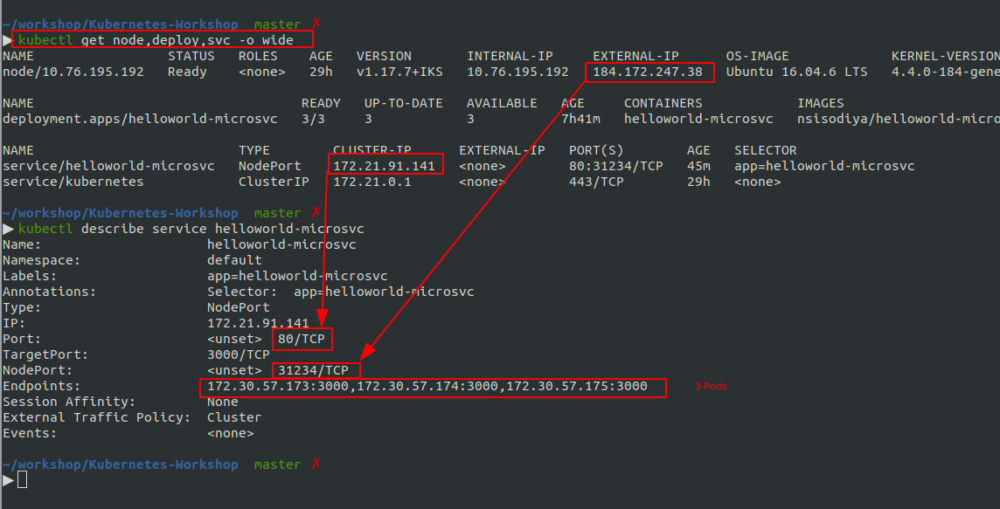
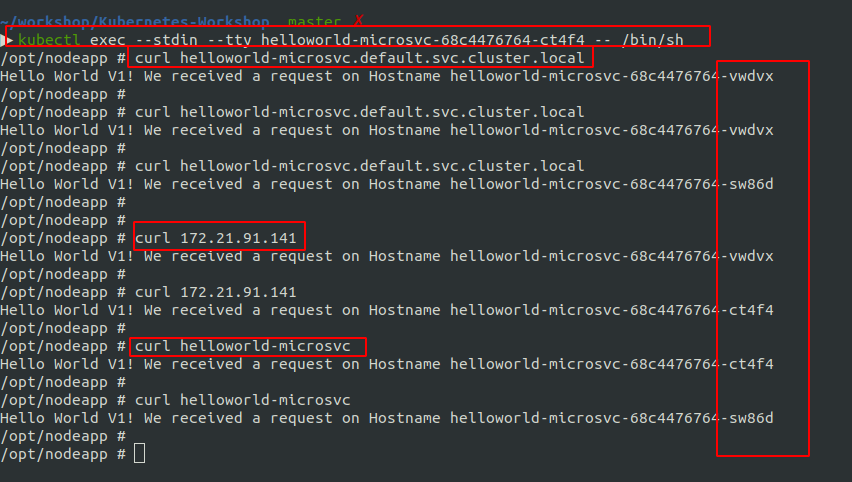
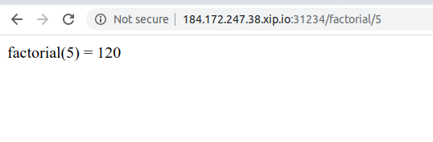

Chapter 5 - Expose Deployment Using Services
============================================

Image taken from https://cloud.ibm.com/docs/containers?topic=containers-cs_network_planning

[](#)

Nodeport
========
content of `deploy/1-helloworld-service-nodeport.yaml`

```yml
kind: Service
apiVersion: v1
metadata:
  name: helloworld-microsvc
  labels:
    app: helloworld-microsvc
spec:
  type: NodePort
  selector:
    app: helloworld-microsvc
  ports:
    - port: 80
      targetPort: 3000
      nodePort: 31234
```

and lets apply this settings.

```sh
cd deploy
kubectl apply -f 1-helloworld-service-nodeport.yaml
kubectl get svc,node -owide
kubectl describe service helloworld-microsvc
```


[](#)

Make sure, you have `endpoints`. These endpoints are basically our 3 pods.


Understand Port TargetPort and Nodeport
========================================
In the above example, 

We can access our service from external machine using `<external-ip>:<node-port>`

```sh
curl http://184.172.247.38:31234  # From your local Machine
```

We can access our service inside cluster using  `<cluster-ip>:<port>`

```sh
# Inside the cluster
curl 172.21.91.141:80
curl helloworld-microsvc:80
curl helloworld-microsvc.default.svc.cluster.local:80
```
Since default port of http is 80 so we can simply write

```sh
# Inside the cluster
curl 172.21.91.141
curl helloworld-microsvc
curl helloworld-microsvc.default.svc.cluster.local
```

TargetPort is 3000, which tell where port our service is using inside the container.


Access Nodeport Service from You local machine
==============================================
In the above example, External IP of our WorkerNode is `184.172.247.38` and we have exposed port `31234`.
So anybody outside from this worker ndoe, can access our service via `http://184.172.247.38:31234`

```sh
curl 184.172.247.38:31234
```

[](#)

You can see, all 3 containers serve the request one by one. This is simple load balancing between containers.

In the `Free Cluster` we only have one node. We will check this behaviour with multiple worker node.


Access Nodeport Service inside cluster
======================================

Inside cluster, now we can access our service using ClusteIP or ServiceName.

```sh
kubectl exec --stdin --tty helloworld-microsvc-68c4476764-ct4f4 -- /bin/sh
curl 172.21.91.141
curl helloworld-microsvc
curl helloworld-microsvc.default.svc.cluster.local
```

[](#)


xip.io DNS
==========
We can also access our ip address using dynamic dns service.

for example - `http://184.172.247.38.xip.io:31234/factorial/5` is the url for accessing our factorial function.

[](#)

Next?
======

So we have accessed our service from Public network using IP address.
From here we can do so many things.

1. Try using multiple microservices. http://example.com/user-service, http://example.com/auth-service
2. We can set path based routing between multiple services
3. We can stress test our cluster and see behaviour under heavy load. and see if adding more pods help?
4. We can user `knative` for scaling our service on load.
5. We have mainly used IP address and we can set proper domain name like `http://api.my-startup.io/user-service`
6. We also need to explore Ingress, ALB etc.

Lets first do a load testing and scale our pods manually.


[NEXT: 6-Load-Testing-and-Scaling](./6-Load-Testing-and-Scaling.md)