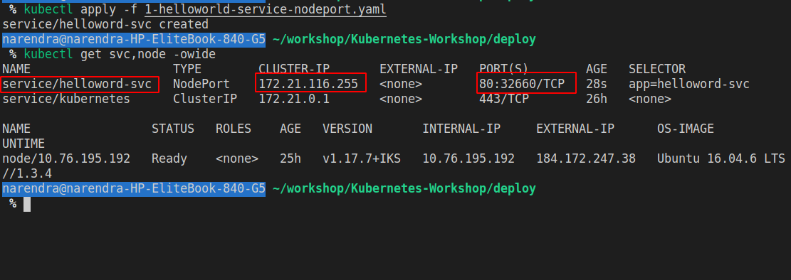

Chapter 5 - Expose Deployment Using Services
============================================


Nodeport
========
content of `deploy/1-helloworld-service-nodeport.yaml`

```
kind: Service
apiVersion: v1
metadata:
  name: helloword-svc
spec:
  type: NodePort
  selector:
    app: helloword-svc
  ports:
    - port: 80
      targetPort: 3000
```

and lets apply this settings.

```
cd deploy
kubectl apply -f 1-helloworld-service-nodeport.yaml
kubectl get svc,node -owide
```

[](#)
