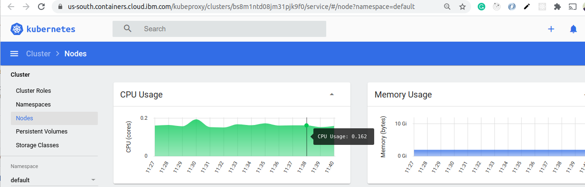
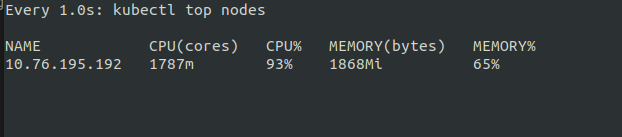
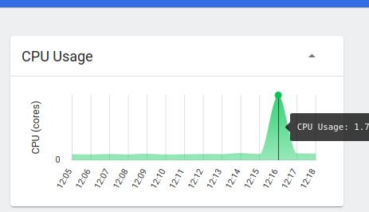

Chapter 6 - Load Testing and Scaling
====================================

We will be using hey - https://github.com/rakyll/hey first install and lets run our first command.

How to see CPU Utilisation
==========================
```sh
watch -n 1 kubectl top nodes
```

this will output as

```sh
Every 1.0s: kubectl top nodes

NAME            CPU(cores)   CPU%   MEMORY(bytes)   MEMORY%   
10.76.195.192   153m         7%     2006Mi          70%
```

You can also see CPU load using Kubernetes Dashboard

[](#)

Load
====

```sh
ulimit -n 10000
hey -z 20s -c 5000 http://184.172.247.38:31234/factorial/100
```

We ran 5000 concurrent request for 20 seconds.

```txt
▶ hey -z 20s -c 5000 http://184.172.247.38:31234/factorial/100

Summary:
  Total:	29.4834 secs
  Slowest:	20.0001 secs
  Fastest:	0.5955 secs
  Average:	3.4333 secs
  Requests/sec:	600.3377
  
  Total data:	588159 bytes
  Size/request:	39 bytes

Response time histogram:
  0.595 [1]	|
  2.536 [6362]	|■■■■■■■■■■■■■■■■■■■■■■■■■■■■■■■■■■■■■■■■
  4.476 [5420]	|■■■■■■■■■■■■■■■■■■■■■■■■■■■■■■■■■■
  6.417 [1982]	|■■■■■■■■■■■■
  8.357 [806]	  |■■■■■
  10.298 [161]	|■
  12.238 [28]	  |
  14.179 [31]	  |
  16.119 [258]	|■■
  18.060 [1]	  |
  20.000 [31]	  |


Latency distribution:
  10% in 1.2811 secs
  25% in 1.8945 secs
  50% in 2.8071 secs
  75% in 4.2495 secs
  90% in 6.0853 secs
  95% in 7.9495 secs
  99% in 15.3160 secs

Details (average, fastest, slowest):
  DNS+dialup:	0.1076 secs, 0.5955 secs, 20.0001 secs
  DNS-lookup:	0.0000 secs, 0.0000 secs, 0.0000 secs
  req write:	0.0001 secs, 0.0000 secs, 0.0158 secs
  resp wait:	3.2608 secs, 0.3546 secs, 19.9996 secs
  resp read:	0.0001 secs, 0.0000 secs, 0.0182 secs

Status code distribution:
  [200]	15081 responses

Error distribution:
  [2619]	Get http://184.172.247.38:31234/factorial/100: net/http: request canceled (Client.Timeout exceeded while awaiting headers)

```

CPU

[](#)

[](#)

We can see that there are errors and CPU reached 93%.
Graph also see a sudden peack. Slowest request is taking 20 seconds.
Our tool fired 17700 and 2619 failed so our failure rate is 14%.

If we reduce the concurrent requests then this failure rate can be reduced.

like
```sh
▶ hey -z 20s -c 50 http://184.172.247.38:31234/factorial/100

Summary:
  Total:	20.2909 secs
  Slowest:	0.9200 secs
  Fastest:	0.2669 secs
  Average:	0.2911 secs
  Requests/sec:	170.5693
  
  Total data:	134979 bytes
  Size/request:	39 bytes

Response time histogram:
  0.267 [1]	|
  0.332 [3382]	|■■■■■■■■■■■■■■■■■■■■■■■■■■■■■■■■■■■■■■■■
  0.398 [12]	|
  0.463 [0]	|
  0.528 [0]	|
  0.593 [0]	|
  0.659 [20]	|
  0.724 [30]	|
  0.789 [11]	|
  0.855 [4]	|
  0.920 [1]	|


Latency distribution:
  10% in 0.2741 secs
  25% in 0.2769 secs
  50% in 0.2811 secs
  75% in 0.2874 secs
  90% in 0.2973 secs
  95% in 0.3064 secs
  99% in 0.6737 secs

Details (average, fastest, slowest):
  DNS+dialup:	0.0049 secs, 0.2669 secs, 0.9200 secs
  DNS-lookup:	0.0000 secs, 0.0000 secs, 0.0000 secs
  req write:	0.0001 secs, 0.0000 secs, 0.0078 secs
  resp wait:	0.2859 secs, 0.2667 secs, 0.9198 secs
  resp read:	0.0001 secs, 0.0000 secs, 0.0007 secs

Status code distribution:
  [200]	3461 responses

```


More Pods
=========
Lets deploy more pods. Open `1-helloworld-deployment.yaml` and change `spec.replicas` to 5 and run following command.

```sh
cd deploy
kubectl apply -f 1-helloworld-deployment.yaml
watch -n 1 kubectl get pods
```

```sh
▶ kubectl get pods         
NAME                                   READY   STATUS    RESTARTS   AGE
helloworld-microsvc-6fc895f684-7cr5c   1/1     Running   0          26s
helloworld-microsvc-6fc895f684-7zhbq   1/1     Running   0          19m
helloworld-microsvc-6fc895f684-mdqwf   1/1     Running   0          20m
helloworld-microsvc-6fc895f684-mjg28   1/1     Running   0          19m
helloworld-microsvc-6fc895f684-vgfkc   1/1     Running   0          26s
```

We can see 5 containers are running.

There is a small improvement.

```sh
▶ hey -z 20s -c 5000 http://184.172.247.38:31234/factorial/100

Summary:
  Total:	26.6128 secs
  Slowest:	20.0736 secs
  Fastest:	0.6624 secs
  Average:	5.6549 secs
  Requests/sec:	675.7652
  
  Total data:	666588 bytes
  Size/request:	39 bytes

Response time histogram:
  0.662 [1]	|
  2.604 [2211]	|■■■■■■■■■■■■■■
  4.545 [6489]	|■■■■■■■■■■■■■■■■■■■■■■■■■■■■■■■■■■■■■■■■
  6.486 [4071]	|■■■■■■■■■■■■■■■■■■■■■■■■■
  8.427 [1315]	|■■■■■■■■
  10.368 [883]	|■■■■■
  12.309 [793]	|■■■■■
  14.250 [546]	|■■■
  16.191 [297]	|■■
  18.133 [283]	|■■
  20.074 [203]	|■


Latency distribution:
  10% in 2.3345 secs
  25% in 3.3461 secs
  50% in 4.4857 secs
  75% in 6.5413 secs
  90% in 11.2863 secs
  95% in 13.6246 secs
  99% in 18.2613 secs

Details (average, fastest, slowest):
  DNS+dialup:	0.1526 secs, 0.6624 secs, 20.0736 secs
  DNS-lookup:	0.0000 secs, 0.0000 secs, 0.0000 secs
  req write:	0.0001 secs, 0.0000 secs, 0.0123 secs
  resp wait:	4.8727 secs, 0.2731 secs, 19.1450 secs
  resp read:	0.0001 secs, 0.0000 secs, 0.0158 secs

Status code distribution:
  [200]	17092 responses

Error distribution:
  [768]	Get http://184.172.247.38:31234/factorial/100: net/http: request canceled (Client.Timeout exceeded while awaiting headers)
  [1]	Get http://184.172.247.38:31234/factorial/100: read tcp 192.168.1.29:34180->184.172.247.38:31234: read: connection reset by peer

```


```sh
▶ hey -z 20s -c 50 http://184.172.247.38:31234/factorial/100

Summary:
  Total:	20.7277 secs
  Slowest:	5.7829 secs
  Fastest:	0.2678 secs
  Average:	0.4476 secs
  Requests/sec:	108.7918
  
  Total data:	87945 bytes
  Size/request:	39 bytes

Response time histogram:
  0.268 [1]	|
  0.819 [1979]	|■■■■■■■■■■■■■■■■■■■■■■■■■■■■■■■■■■■■■■■■
  1.371 [203]	|■■■■
  1.922 [15]	|
  2.474 [46]	|■
  3.025 [4]	|
  3.577 [1]	|
  4.128 [0]	|
  4.680 [0]	|
  5.231 [1]	|
  5.783 [5]	|


Latency distribution:
  10% in 0.2789 secs
  25% in 0.2847 secs
  50% in 0.2972 secs
  75% in 0.3420 secs
  90% in 0.8994 secs
  95% in 1.0733 secs
  99% in 2.0971 secs

Details (average, fastest, slowest):
  DNS+dialup:	0.0051 secs, 0.2678 secs, 5.7829 secs
  DNS-lookup:	0.0000 secs, 0.0000 secs, 0.0000 secs
  req write:	0.0000 secs, 0.0000 secs, 0.0005 secs
  resp wait:	0.4368 secs, 0.2675 secs, 5.7825 secs
  resp read:	0.0001 secs, 0.0000 secs, 0.0025 secs

Status code distribution:
  [200]	2255 responses
```