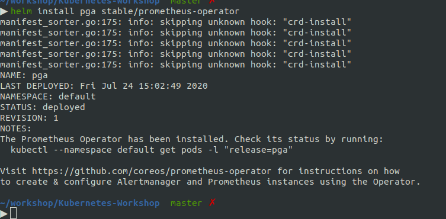
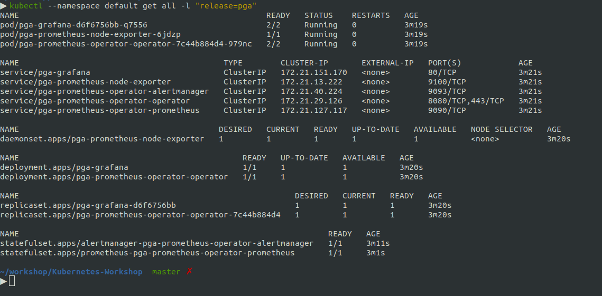
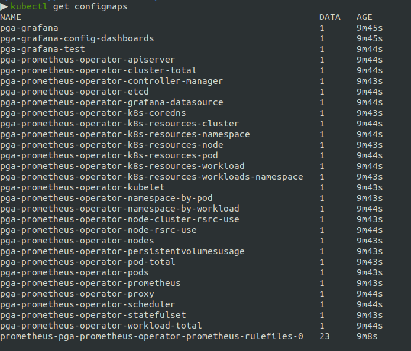
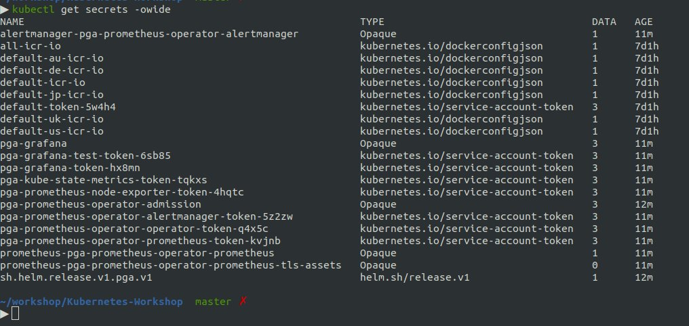
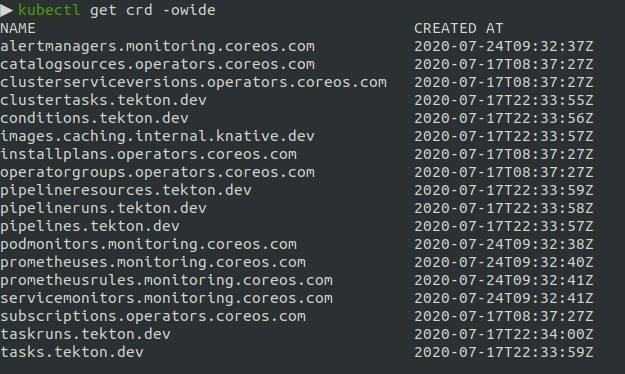
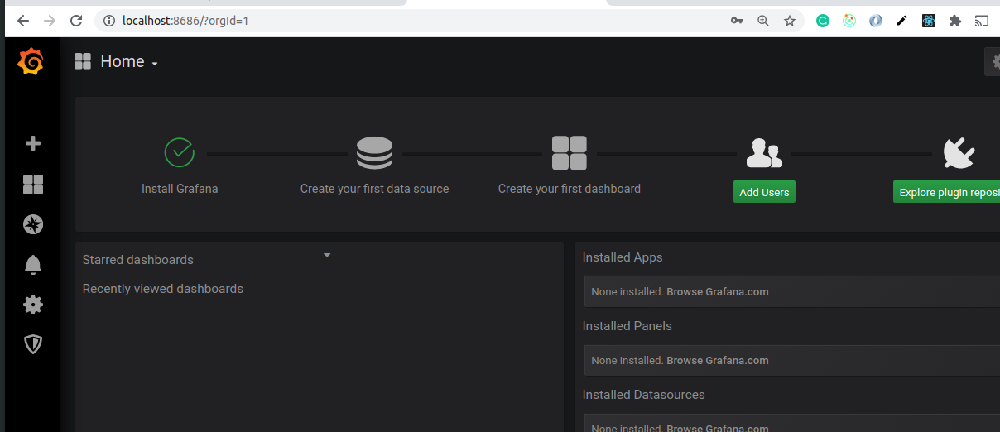

Chapter 8 - Helm
=================

We can use `Helm Charts` to deploy any kind of services on our cluster. In last example, we have created 2 YML files to deploy our small micro-service. In many cases, these yml files can be large number.

Install Helm command on laptop
==============================
Follow instructions at - https://helm.sh/docs/intro/install/


Setup Prometheus and Grafana using Prometheus Operator
=======================================================
Detailed video - https://www.youtube.com/watch?v=QoDqxm7ybLc

from: https://github.com/helm/charts/tree/master/stable/prometheus-operator

```sh
helm install pga stable/prometheus-operator
```

`pga` is our custom name. it will be used for label.


[](#)

Check Status
============

```sh
kubectl --namespace default get all -l "release=pga"
```

[](#)


```sh
kubectl get configmaps 
```

[](#)


```sh
kubectl get secrets -owide 
```

[](#)

```sh
kubectl get crd -owide    
```
[](#)


Use port-forward to access Grafana on localhost
==============================================

know the port first. its 3000 in my case.

```sh
▶ kubectl get pods -owide | grep grafana                                    
pga-grafana-d6f6756bb-q7556                           2/2     Running   0          41m    172.30.57.186   10.76.195.192   <none>           <none>

~/workshop/Kubernetes-Workshop  master ✗                                                                                                                                                                   55m ◒  
▶ kubectl logs pga-grafana-d6f6756bb-q7556 -c grafana | grep 'protocol=http'
t=2020-07-24T09:34:48+0000 lvl=info msg="HTTP Server Listen" logger=http.server address=[::]:3000 protocol=http subUrl= socket=

```

```sh
kubectl port-forward deployment.apps/pga-grafana 8686:3000
```

and open [`http://locahost:8686`](http://localhost:8686/)

username/password is `admin/prom-operator`.

[](#)